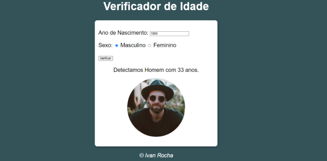

# AivanAge

O projeto AivanAge, teve sua origem através de um curso gratuito de JavaScript, fornecido pelo professor Guanabara, criador do canal Curso em vídeo

O projeto tem como objetivo, mostrar algumas funcionalidades do JavaScript. Podemos ver no projeto, que o JavaScript identifica o ano atual (2023) com o ano escolhido e traça uma idade, com a idade, o sistema irá mostrar uma foto de uma pessoa com 23; 44; 05; 17 anos, podendo também escolher o sexo, como feminino ou masculino.

## Demonstração

## 💻 Tech Stack:
  
  
 

## Material

https://www.cursoemvideo.com/curso/javascript/aulas/condicoes-em-javascript/modulos/exercicios-javascript-parte-3/

## Licença

[MIT License](https://choosealicense.com/licenses/mit/)

## Suporte

Para suporte, mande um email para ivan.rocha.0987@gmail.com ou entre em contato via whatsapp (41) 98468-5317.

## Feedback

Se você tiver algum feedback, por favor enviar para ivan.rocha.0987@gmail.com

## Autores

- [@IvanRocha](https://www.github.com/ivanrocha10)
- [@CursoEmVideo](https://github.com/gustavoguanabara)

## Projeto

  Acesse o "AivanAge" pelo QR:

  

Caso o QR não funcione, acesse <a href="https://ivanrocha10.github.io/AivanAge/">aqui</a>

style {
 imag {
  margin: auto;
 }
}
